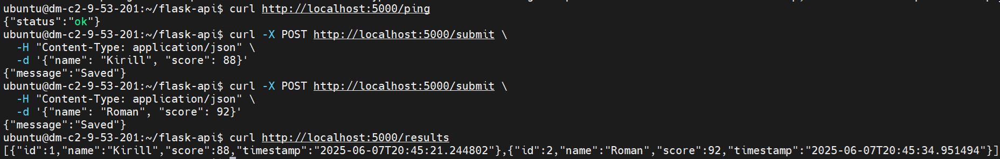

# Lesta Final Project

## Как настроить Jenkins

1. Установите Jenkins и Docker.
2. Создайте Pipeline с типом "Pipeline script from SCM":
   - SCM: Git
   - Repository URL: git@github.com:demon1589g/Lesta_Final.git
   - Credentials: SSH-ключ Jenkins
   - Branch: main
3. Jenkinsfile уже находится в репозитории.

## Как работает CI/CD

- Jenkins запускает pipeline при пуше в main:
  - Клонирует репозиторий
  - Собирает Docker-образ
  - Проверяет код через flake8
  - Пушит образ в DockerHub
  - Подключается по SSH и перезапускает контейнер



## Примеры API-запросов

Проверка доступности:
```bash
curl http://localhost:5000/ping
```

Добавление результата:
```bash
curl -X POST http://localhost:5000/submit \
  -H "Content-Type: application/json" \
  -d '{"name": "Kirill", "score": 88}'
```

Получение всех результатов:
```bash
curl http://localhost:5000/results
```

## Финальные данные

- Репозиторий: https://github.com/demon1589g/Lesta_Final.git  
- Эндпоинт: http://<IP>:5000/results
